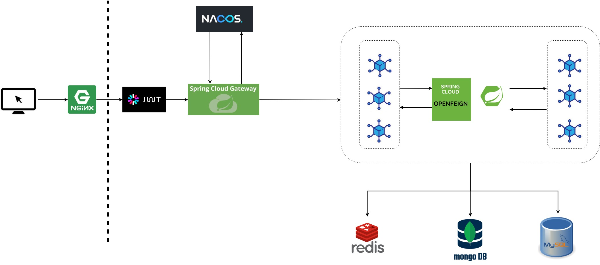
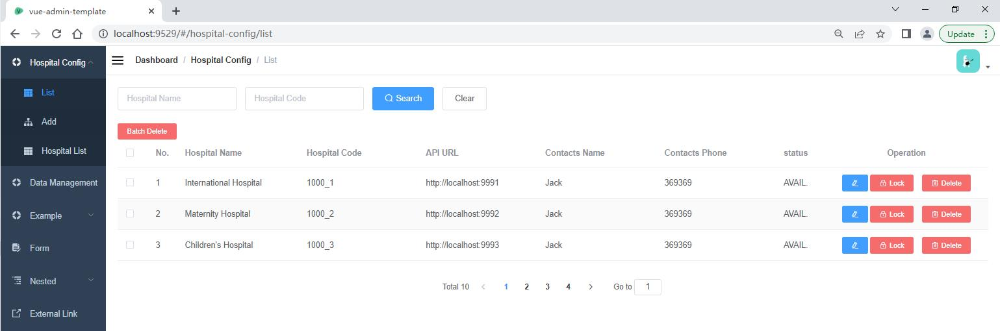
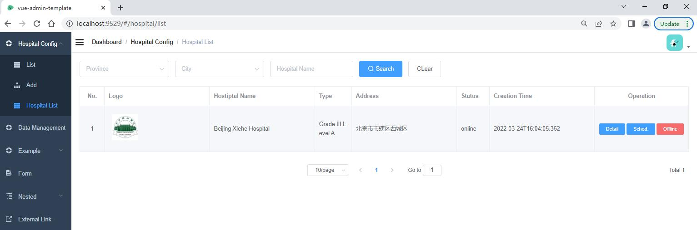
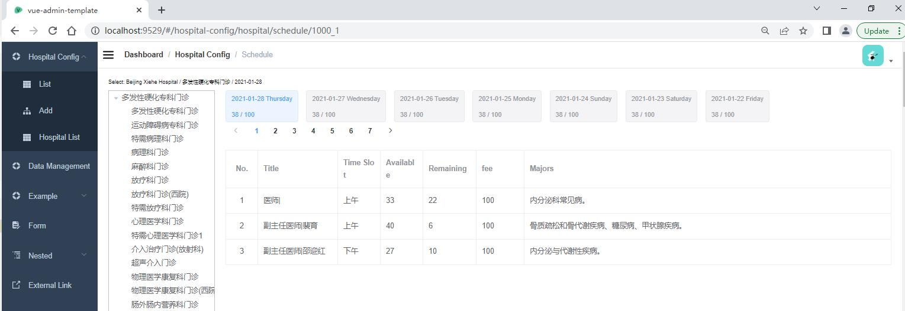
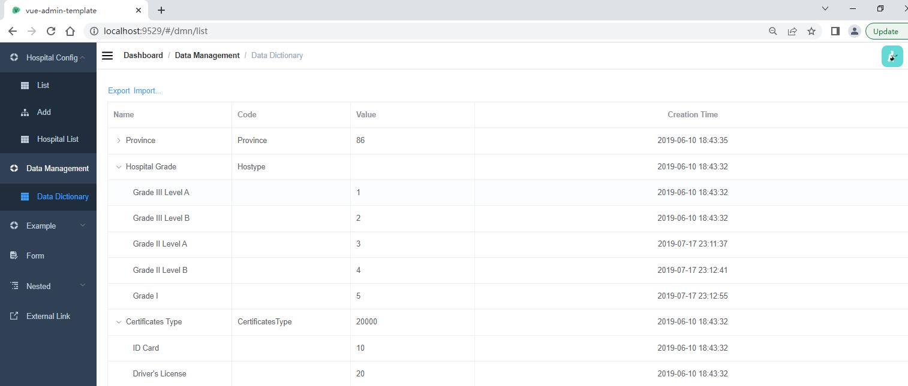
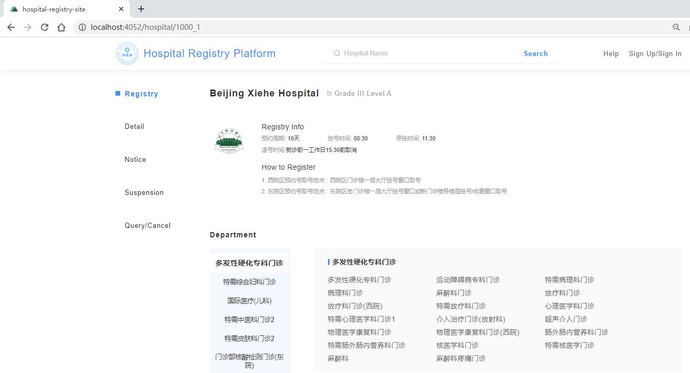

# Online Hospital Registry Platform

## Introduction

- A platform where many hospitals are settled and hospital visitors can register online.

- A front-end and back-end separation project, built with a microservice architecture style.

- Hospitals can be managed by administrators through administrative interface.

- Hospital visitors register on client side.

## Tech Stacks

### Backend

- **Springboot** + **Spring Cloud** + **Spring Cloud Alibaba**
- **Redis** + **MongoDB** + **MyBatis-plus** + **MySQL** 
- **Maven** + **Swagger** + **Lombok**

### Frontend

- **Vue.js** + **element-ui** + **Axios** + **NPM** + **Babel** + **Webpack**

## Architecture

- *Nacos*: Service Register

- *OpenFeign*: Remote Service Invoke

- *MySQL*: for management of user, hospital and dictionary, etc

- *MongoDB*: for large-size, low-value data, such as logo pictures or introduction of a hospital

- *Redis*: for caching dictionary data which includes information such as province/city/district data, 
  or classification of levels of hospital

## Presentations

### Administrator Side

### Client Side

